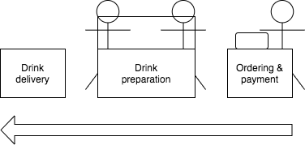

# Coffee shop app

Example used to illustrate a presentation about hexagonal architecture. 

## Use case

This examples focuses on "ordering & payment": a service receives orders from customers; 
it checks that the necessary ingredients are available, sends the order for preparation, and responds with the price.

## Interfaces

* The current service is in charge of resolving the price and the list of necessary ingredients according to a catalogue.
* It checks that the ingredients are available by calling another service which exposes current stock status.
* Orders are sent asynchronously to another service, dedicated to order preparation. 

This translates into 4 ports:
* A driving port, Order Controller, is in charge of receiving orders.
* A driven port, Catalogue, exposes the recipes along with their price.
* A driven port, Stock, exposes current stock status by calling the dedicated service.
* A driven port, Order Preparation, sends the order to the service in charge of order preparation.
